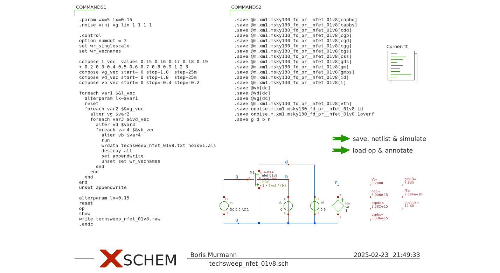

**Scripts for $g_m/I_D$ Lookup-Table Generation (open-source tools: Python/Jupyter, Xschem, Ngspice)**

Similar to what is provided under "closed-source," this folder contains files that can be used for lookup-table generation with open-source tools and process technologies. Shown below is a typical simulation setup. The four-dimensional sweep is implemented using for-loops in Ngspice's control language. This executes relatively fast (a few minutes for a complete sweep).

**What You Need**

* An open-source EDA environment with proper installations of Xschem, Ngspice and the PDK that you want to characterize. A convenient way to achieve this is using the [IIC-OSIC-TOOLS](https://github.com/iic-jku/IIC-OSIC-TOOLS) Docker container. The provided example files were generated using this Docker container.

* [pygmid](https://github.com/dreoilin/pygmid) to read the generated lookup tables (``pip install pygmid``). This is an open-source alternative to the Matlab function look_up.m provided in the closed-source tool folder.

* Some experience with Linux, Python and setting up EDA tools. The provided files are far from “plug and play.”

**File Descriptions**

The sub-folders for SKY130 and IHP-SG13G2 technologies contain similar files that are customized according to the respective technology details. Unless you want to generate new lookup tables for these technologies (for example with different sweep ranges), you could simply grab the ``*.mat`` files and work with them directly for circuit sizing. Refer to ``lookup_examples.ipynb`` for examples on how to access the data. The most important files are:

*techsweep_*.sch*: Xschem schematics that contain the complete setup for lookup table generation. The output is a text file.

*techsweep_txt_to_mat.ipynb*: Jupyter notebook that translates the raw simulation text file to mat format.

**.mat*: Lookup tables in Matlab file format. These can be used within Matlab scripts or Python (using pygmid).
